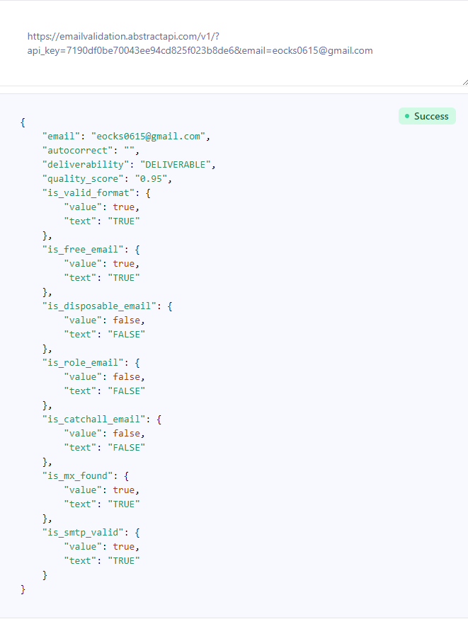

# CSC207 Project - Email Validating System
# Contributors:
- DaeChan Eom
- DongHyeon Kim
- Victor Su
- Justin Yoon
  
# About:
This project is a directory focusing on a project domain based on an Email Validating System. We plan to develop ...

# Screenshots:
 \\
This is a screenshot of trying out the Email Validation API.

Problem Domain Description: 

brief, high-level description of what kind of application your team is thinking of developing.:

a link to the documentation for an API:

screenshot of using a tool to try out the API:

example output of running your Java code:

a list of any technical problems blocking progress :
